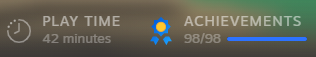
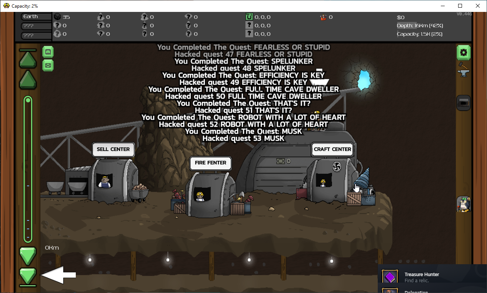
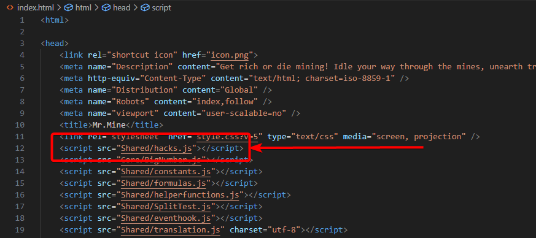

# MrMine-Steam-Achievements-Cheat
 A simple cheat / hack to obtain **all achievements (also triggers Steam achievement)** in the game 'MrMine' with a single press of a button:





This is making use of the fact that the MrMine Steam build provides the entire source-code and can easily be edited to your hearts content.

## How to use

Take the `hacks.js` file and move it into the `win-unpacked\resources\app\Shared` folder of your installation, usually:

```
<steam-location>\steamapps\common\MrMine\win-unpacked\resources\app\Shared
```
This file adds a new hotkey (button `y`, feel free to change it) to trigger the achievements.

Then, open the file `win-unpacked\resources\app\index.html` in a text editor and add the line 
```js
<script src="Shared/hacks.js"></script>
``` 
to the `<head>` element. This change makes sure the `hacks.js` is loaded by the game. It should look something like this:



Now you can launch the game, load your save and press the shortcut key `y`. You will obtain every achievement you're missing, delayed to give you one achievement per second. Just give it a minute or two and you should have all.